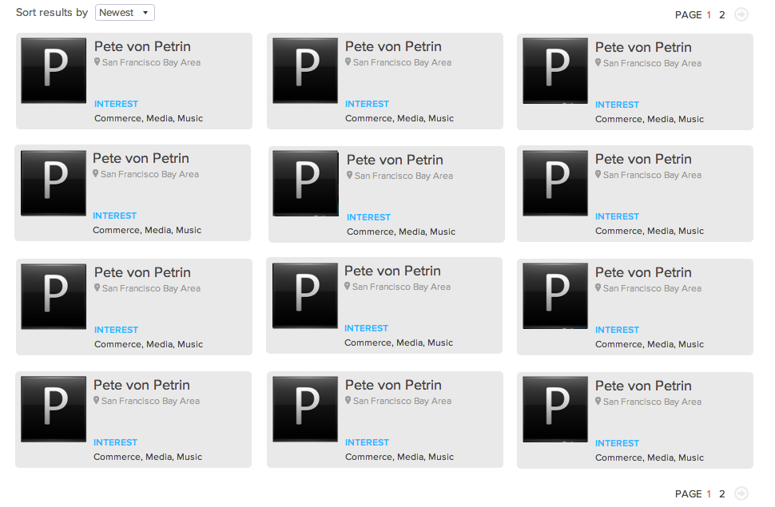

#Datatable
*Homework - 5 hours max*

##Goal 

Programmatically display the data in [people.json](people.json) to match the layout in
`model.png`. Include **pagination and sorting** (by newest to oldest & oldest to
newest)

The most important is to get the features implemented, not to perfectly match the model. 

##Extra

* Allow marking a result as a "favorite". 
* Allow A-Z and Z-A sorting by result last name.  
